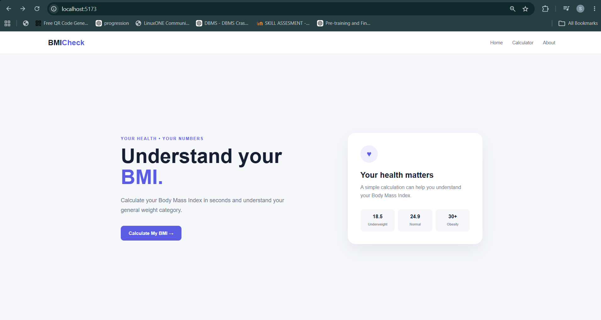
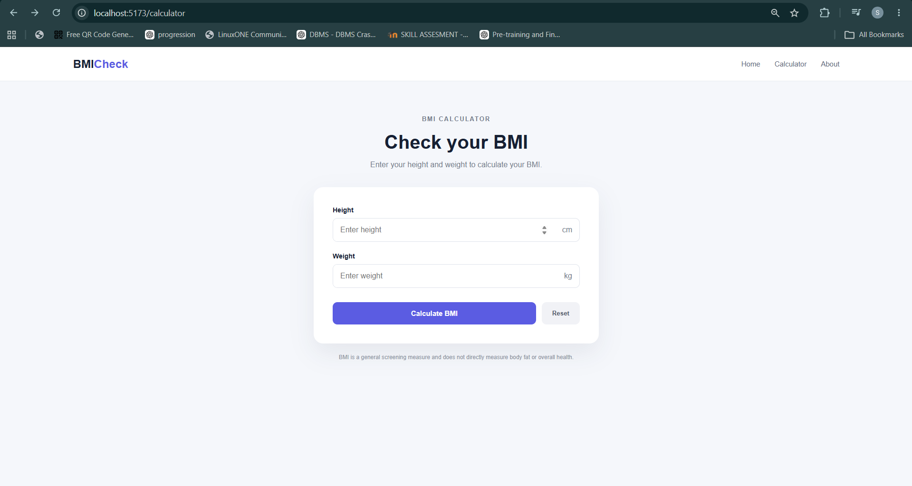
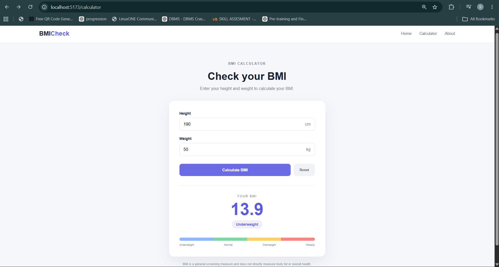
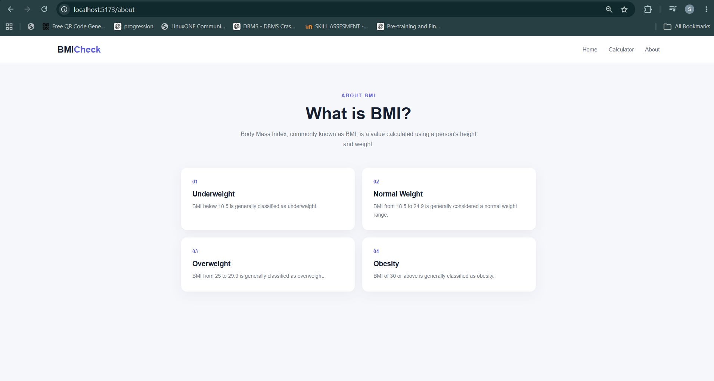

# Ex06 BMI Calculator
## Date: 01-09-2026

## AIM
To create a BMI calculator using React Router 

## ALGORITHM
### STEP 1 State Initialization
Manage the current page (Home or Calculator) using React Router.

### STEP 2 User Input
Accept weight and height inputs from the user.

### STEP 3 BMI Calculation
Calculate the BMI based on user input.

### STEP 4 Categorization
Classify the BMI result into categories (Underweight, Normal weight, Overweight, Obesity).

### STEP 5 Navigation
Navigate between pages using React Router.

## PROGRAM

### main.jsx
```
import React from "react";
import ReactDOM from "react-dom/client";
import { BrowserRouter } from "react-router-dom";
import App from "./App";
import "./index.css";

ReactDOM.createRoot(document.getElementById("root")).render(
  <React.StrictMode>
    <BrowserRouter>
      <App />
    </BrowserRouter>
  </React.StrictMode>
);
```

### App.jsx
```
import { Routes, Route } from "react-router-dom";

import Navbar from "./components/Navbar";
import Home from "./pages/Home";
import Calculator from "./pages/Calculator";
import About from "./pages/About";

function App() {
  return (
    <>
      <Navbar />

      <Routes>
        <Route path="/" element={<Home />} />
        <Route path="/calculator" element={<Calculator />} />
        <Route path="/about" element={<About />} />
      </Routes>
    </>
  );
}

export default App;
```

### Navbar.jsx
```
import { Link } from "react-router-dom";

function Navbar() {
  return (
    <nav className="navbar">
      <Link to="/" className="logo">
        BMI<span>Check</span>
      </Link>

      <div className="nav-links">
        <Link to="/">Home</Link>
        <Link to="/calculator">Calculator</Link>
        <Link to="/about">About</Link>
      </div>
    </nav>
  );
}

export default Navbar;
```

### Home.jsx
```
import { Link } from "react-router-dom";

function Home() {
  return (
    <main className="home-page">
      <section className="hero">

        <div className="hero-content">

          <p className="small-title">
            YOUR HEALTH • YOUR NUMBERS
          </p>

          <h1>
            Understand your
            <span> BMI.</span>
          </h1>

          <p className="hero-text">
            Calculate your Body Mass Index in seconds and
            understand your general weight category.
          </p>

          <Link to="/calculator" className="primary-button">
            Calculate My BMI →
          </Link>

        </div>

        <div className="hero-card">

          <div className="heart-icon">
            ♥
          </div>

          <h3>
            Your health matters
          </h3>

          <p>
            A simple calculation can help you understand
            your Body Mass Index.
          </p>

          <div className="mini-stats">

            <div>
              <strong>18.5</strong>
              <span>Underweight</span>
            </div>

            <div>
              <strong>24.9</strong>
              <span>Normal</span>
            </div>

            <div>
              <strong>30+</strong>
              <span>Obesity</span>
            </div>

          </div>

        </div>

      </section>
    </main>
  );
}

export default Home;
```

### Calculator.jsx
```
import { useState } from "react";

function Calculator() {

  const [height, setHeight] = useState("");
  const [weight, setWeight] = useState("");

  const [bmi, setBmi] = useState(null);
  const [category, setCategory] = useState("");

  const calculateBMI = () => {

    if (height <= 0 || weight <= 0) {
      alert("Please enter valid height and weight.");
      return;
    }

    const heightInMeters = height / 100;

    const bmiValue =
      weight / (heightInMeters * heightInMeters);

    setBmi(bmiValue.toFixed(1));

    if (bmiValue < 18.5) {
      setCategory("Underweight");
    }
    else if (bmiValue < 25) {
      setCategory("Normal Weight");
    }
    else if (bmiValue < 30) {
      setCategory("Overweight");
    }
    else {
      setCategory("Obesity");
    }
  };

  const resetCalculator = () => {
    setHeight("");
    setWeight("");
    setBmi(null);
    setCategory("");
  };

  return (
    <main className="calculator-page">

      <div className="calculator-container">

        <div className="calculator-header">

          <p className="small-title">
            BMI CALCULATOR
          </p>

          <h1>
            Check your BMI
          </h1>

          <p>
            Enter your height and weight to calculate your BMI.
          </p>

        </div>

        <div className="calculator-card">

          <div className="input-group">

            <label>
              Height
            </label>

            <div className="input-wrapper">

              <input
                type="number"
                placeholder="Enter height"
                value={height}
                onChange={(e) => setHeight(e.target.value)}
              />

              <span>
                cm
              </span>

            </div>

          </div>

          <div className="input-group">

            <label>
              Weight
            </label>

            <div className="input-wrapper">

              <input
                type="number"
                placeholder="Enter weight"
                value={weight}
                onChange={(e) => setWeight(e.target.value)}
              />

              <span>
                kg
              </span>

            </div>

          </div>

          <div className="button-group">

            <button
              className="primary-button calculate-button"
              onClick={calculateBMI}
            >
              Calculate BMI
            </button>

            <button
              className="reset-button"
              onClick={resetCalculator}
            >
              Reset
            </button>

          </div>

          {bmi && (

            <div className="result">

              <p className="result-label">
                YOUR BMI
              </p>

              <div className="bmi-number">
                {bmi}
              </div>

              <div className="category">
                {category}
              </div>

              <div className="bmi-scale">

                <div className="scale-bar">
                  <div className="underweight"></div>
                  <div className="normal"></div>
                  <div className="overweight"></div>
                  <div className="obese"></div>
                </div>

                <div className="scale-labels">
                  <span>Underweight</span>
                  <span>Normal</span>
                  <span>Overweight</span>
                  <span>Obesity</span>
                </div>

              </div>

            </div>

          )}

        </div>

        <p className="disclaimer">
          BMI is a general screening measure and does not
          directly measure body fat or overall health.
        </p>

      </div>

    </main>
  );
}

export default Calculator;
```

### About.jsx
```
function About() {

  return (
    <main className="about-page">

      <div className="about-container">

        <p className="small-title">
          ABOUT BMI
        </p>

        <h1>
          What is BMI?
        </h1>

        <p className="about-intro">
          Body Mass Index, commonly known as BMI, is a
          value calculated using a person's height and weight.
        </p>

        <div className="info-grid">

          <div className="info-card">

            <div className="info-number">
              01
            </div>

            <h3>
              Underweight
            </h3>

            <p>
              BMI below 18.5 is generally classified as
              underweight.
            </p>

          </div>

          <div className="info-card">

            <div className="info-number">
              02
            </div>

            <h3>
              Normal Weight
            </h3>

            <p>
              BMI from 18.5 to 24.9 is generally considered
              a normal weight range.
            </p>

          </div>

          <div className="info-card">

            <div className="info-number">
              03
            </div>

            <h3>
              Overweight
            </h3>

            <p>
              BMI from 25 to 29.9 is generally classified
              as overweight.
            </p>

          </div>

          <div className="info-card">

            <div className="info-number">
              04
            </div>

            <h3>
              Obesity
            </h3>

            <p>
              BMI of 30 or above is generally classified
              as obesity.
            </p>

          </div>

        </div>

      </div>

    </main>
  );
}

export default About;
```

### index.css

```
* {
  margin: 0;
  padding: 0;
  box-sizing: border-box;
}

body {
  font-family: Arial, Helvetica, sans-serif;
  background: #f5f7fb;
  color: #172033;
}

a {
  text-decoration: none;
  color: inherit;
}

/* NAVBAR */

.navbar {
  height: 72px;
  background: white;
  display: flex;
  align-items: center;
  justify-content: space-between;
  padding: 0 8%;
  border-bottom: 1px solid #e8ebf0;
}

.logo {
  font-size: 24px;
  font-weight: bold;
}

.logo span {
  color: #5b5ce2;
}

.nav-links {
  display: flex;
  gap: 30px;
}

.nav-links a {
  color: #606778;
  font-size: 15px;
}

.nav-links a:hover {
  color: #5b5ce2;
}

/* COMMON */

.small-title {
  font-size: 13px;
  font-weight: bold;
  letter-spacing: 2px;
  color: #5b5ce2;
  margin-bottom: 15px;
}

/* HOME */

.home-page {
  min-height: calc(100vh - 72px);
  display: flex;
  align-items: center;
}

.hero {
  width: 84%;
  max-width: 1150px;
  margin: auto;

  display: grid;
  grid-template-columns: 1.2fr 0.8fr;

  gap: 80px;
  align-items: center;
}

.hero-content h1 {
  font-size: 64px;
  line-height: 1.05;
  margin-bottom: 25px;
}

.hero-content h1 span {
  color: #5b5ce2;
}

.hero-text {
  color: #697386;
  font-size: 18px;
  line-height: 1.7;
  max-width: 550px;
  margin-bottom: 35px;
}

.primary-button {
  display: inline-block;

  background: #5b5ce2;
  color: white;

  padding: 15px 25px;

  border: none;
  border-radius: 10px;

  font-size: 15px;
  font-weight: bold;

  cursor: pointer;
}

.primary-button:hover {
  opacity: 0.9;
}

.hero-card {
  background: white;
  border-radius: 24px;
  padding: 40px;

  box-shadow: 0 20px 50px rgba(30, 40, 70, 0.08);
}

.heart-icon {
  width: 55px;
  height: 55px;

  border-radius: 50%;

  background: #eeeefe;
  color: #5b5ce2;

  display: flex;
  justify-content: center;
  align-items: center;

  font-size: 24px;

  margin-bottom: 25px;
}

.hero-card h3 {
  font-size: 25px;
  margin-bottom: 12px;
}

.hero-card p {
  color: #737b8c;
  line-height: 1.6;
  margin-bottom: 30px;
}

.mini-stats {
  display: grid;
  grid-template-columns: repeat(3, 1fr);
  gap: 10px;
}

.mini-stats div {
  background: #f6f7fb;
  padding: 15px 8px;
  border-radius: 10px;
  text-align: center;
}

.mini-stats strong {
  display: block;
  margin-bottom: 5px;
}

.mini-stats span {
  font-size: 11px;
  color: #747c8c;
}

/* CALCULATOR */

.calculator-page {
  min-height: calc(100vh - 72px);
  padding: 70px 20px;
}

.calculator-container {
  width: 100%;
  max-width: 600px;
  margin: auto;
}

.calculator-header {
  text-align: center;
  margin-bottom: 35px;
}

.calculator-header h1 {
  font-size: 40px;
  margin-bottom: 12px;
}

.calculator-header p {
  color: #737b8c;
  line-height: 1.6;
}

.calculator-card {
  background: white;
  padding: 40px;
  border-radius: 20px;

  box-shadow: 0 20px 50px rgba(30, 40, 70, 0.08);
}

.input-group {
  margin-bottom: 22px;
}

.input-group label {
  display: block;
  font-size: 14px;
  font-weight: bold;
  margin-bottom: 9px;
}

.input-wrapper {
  display: flex;
  align-items: center;

  border: 1px solid #dfe3eb;
  border-radius: 10px;

  overflow: hidden;
}

.input-wrapper input {
  width: 100%;

  border: none;
  outline: none;

  padding: 15px;

  font-size: 16px;
}

.input-wrapper span {
  padding: 0 15px;
  color: #747c8c;
}

.button-group {
  display: flex;
  gap: 12px;
  margin-top: 30px;
}

.calculate-button {
  flex: 1;
}

.reset-button {
  padding: 15px 22px;

  background: #f1f2f6;
  color: #4f5667;

  border: none;
  border-radius: 10px;

  cursor: pointer;
  font-weight: bold;
}

/* RESULT */

.result {
  margin-top: 35px;
  padding-top: 35px;

  border-top: 1px solid #e8ebf0;

  text-align: center;
}

.result-label {
  font-size: 12px;
  letter-spacing: 2px;
  color: #777f90;
}

.bmi-number {
  font-size: 65px;
  font-weight: bold;
  color: #5b5ce2;

  margin: 5px 0;
}

.category {
  display: inline-block;

  background: #eeeefe;
  color: #5b5ce2;

  padding: 8px 16px;

  border-radius: 20px;

  font-weight: bold;
  font-size: 14px;
}

.bmi-scale {
  margin-top: 35px;
}

.scale-bar {
  height: 12px;

  display: flex;

  border-radius: 10px;
  overflow: hidden;
}

.scale-bar div {
  flex: 1;
}

.underweight {
  background: #8db7ff;
}

.normal {
  background: #7ed6a5;
}

.overweight {
  background: #ffd166;
}

.obese {
  background: #ff8585;
}

.scale-labels {
  display: flex;
  justify-content: space-between;

  margin-top: 10px;
}

.scale-labels span {
  font-size: 10px;
  color: #737b8c;
}

.disclaimer {
  text-align: center;

  margin-top: 20px;

  font-size: 12px;
  color: #8a91a0;

  line-height: 1.5;
}

/* ABOUT */

.about-page {
  min-height: calc(100vh - 72px);
  padding: 80px 20px;
}

.about-container {
  max-width: 950px;
  margin: auto;

  text-align: center;
}

.about-container h1 {
  font-size: 45px;
  margin-bottom: 15px;
}

.about-intro {
  max-width: 650px;
  margin: auto;

  color: #737b8c;
  line-height: 1.7;
}

.info-grid {
  margin-top: 50px;

  display: grid;
  grid-template-columns: repeat(2, 1fr);

  gap: 20px;
}

.info-card {
  background: white;

  padding: 30px;

  border-radius: 16px;

  text-align: left;

  box-shadow: 0 10px 30px rgba(30, 40, 70, 0.05);
}

.info-number {
  color: #5b5ce2;
  font-size: 13px;
  font-weight: bold;

  margin-bottom: 15px;
}

.info-card h3 {
  margin-bottom: 10px;
}

.info-card p {
  color: #737b8c;
  line-height: 1.6;
  font-size: 14px;
}

/* MOBILE */

@media (max-width: 800px) {

  .hero {
    grid-template-columns: 1fr;
    gap: 40px;
    padding: 50px 0;
  }

  .hero-content h1 {
    font-size: 48px;
  }

  .info-grid {
    grid-template-columns: 1fr;
  }
}

@media (max-width: 500px) {

  .navbar {
    height: auto;
    padding: 20px;

    flex-direction: column;
    gap: 15px;
  }

  .nav-links {
    gap: 15px;
  }

  .hero-content h1 {
    font-size: 40px;
  }

  .hero-card {
    padding: 25px;
  }

  .calculator-card {
    padding: 25px;
  }

  .mini-stats {
    grid-template-columns: 1fr;
  }
}

```


## OUTPUT






## RESULT
The program for creating BMI Calculator using React Router is executed successfully.
